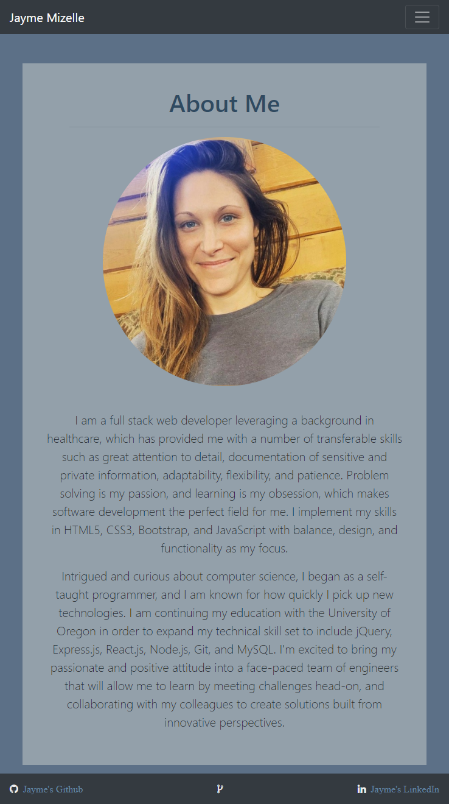
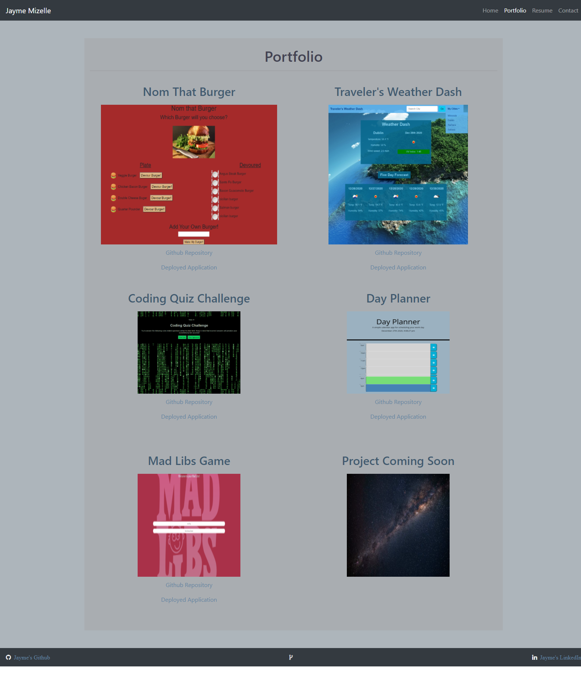
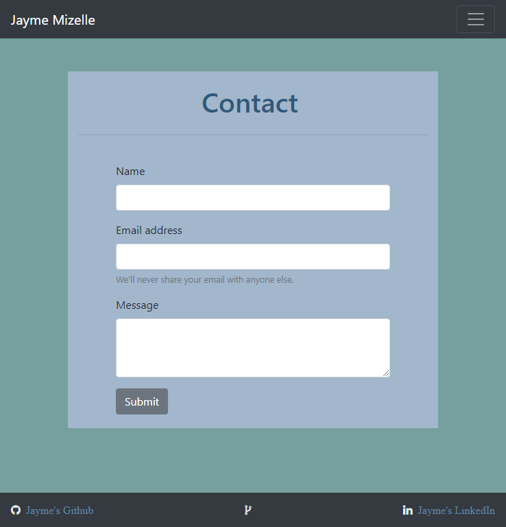

# engineer-portfolio

This application is a very basic portfolio that was built utiilizing Bootstrap to create a responsive and functional site. The focus of this project was to create an application that was designed to render well on a variety of devices and screen sizes.

Deployed Application:  https://jaymemizelle.github.io/engineer-portfolio/
